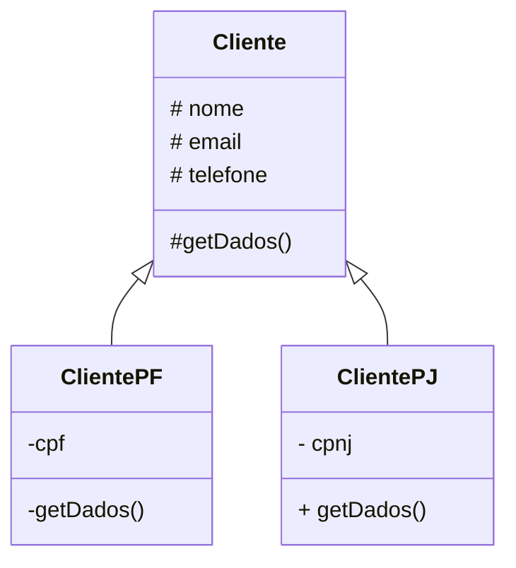

# Diagrama cliente pessoa fisica juridica

+puvlico: qualquer parte do codigo tem acesso
-privado: somente a propria classe tem acesso
#protegido: a propria classe, flihos e netos

```mermaid
classDiagram
Cliente<|-- ClientePF
Cliente<|-- ClientePJ
class Cliente{
    # nome
    # email
    # telefone

    #getDados()
}

class ClientePF{
    -cpf

    -getDados()
}

class ClientePJ{
    - cpnj

    + getDados()
}
```