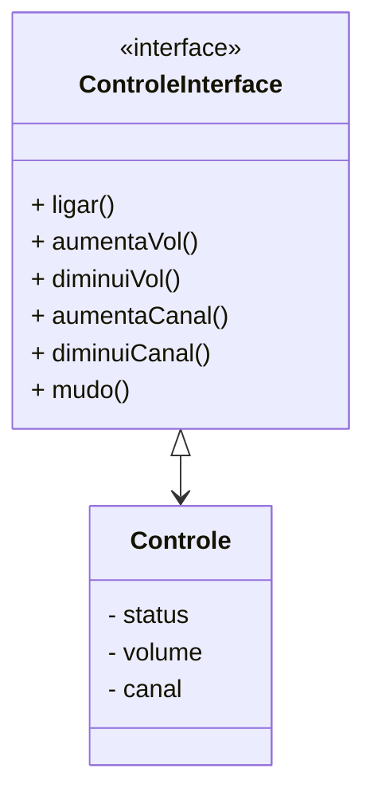

# diagrama Controle interface e repository

```mermaid
classDiagram
ControleInterface <|--> Controle
class ControleInterface{
    <<interface>>
    + ligar()
    + aumentaVol()
    + diminuiVol()
    + aumentaCanal()
    + diminuiCanal()
    + mudo()
}

class Controle{
    - status
    - volume
    - canal
}
```